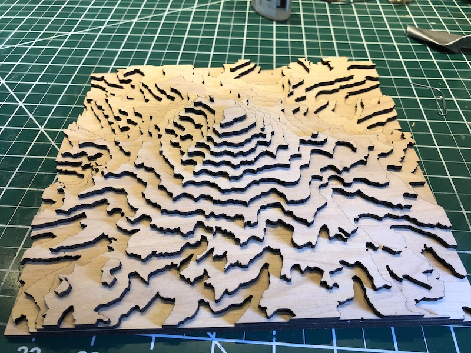

# Topo maps for laser cutters

**This is still very early. This is a one time thing for Rainier. I'll work to generalize this over time perhaps.**



## Prereqs

* [gdal](https://www.gdal.org/) tools.  Install with `brew install gdal` on macOS
* node.js

## Download image
Download map from https://viewer.nationalmap.gov/basic/#startUp.

We are looking for 3DEP (3D elevation program) product data. This is high resolution elevations. I downloaded the 1/3 arc second data and it seems to be good enough.  Everything fit on one tile so I didn't have to play around with stitching them together or anything.  Check out this video: https://www.youtube.com/watch?v=ybI5-2GcGLQ

Looks like there may be an API to download imagery. https://elevation.nationalmap.gov/arcgis/sdk/rest/index.html#//02ss00000021000000.  Need to do more research to see if I can build a tool. Unclear what the API really is. I think this is the [discovery doc](https://index.nationalmap.gov/arcgis/rest/services/3DEPElevationIndex/MapServer?f=pjson) and the API is documented [here](https://developers.arcgis.com/rest/services-reference/resources-and-operations.htm).  There looks to be a client [here](https://github.com/Esri/arcgis-rest-js) but it isn't clear if it supports the methods we'd need.

Download the file from the browser or with curl (359MB) and unzip it. To download the file directly:

```bash
mkdir rainier
cd rainier

curl -LO https://prd-tnm.s3.amazonaws.com/StagedProducts/Elevation/13/ArcGrid/USGS_NED_13_n47w122_ArcGrid.zip
unzip USGS_NED_13_n47w122_ArcGrid.zip
```

## Cropping

I picked the center of rainier and some upper/lower corners using google maps.  These are lat/longs.

* Center of rainier:  46.8517996,-121.7608787
* Upper left, approx: 46.9280266,-121.8643717
* Delta from center: 0.076227, -0.103493
* Bottom Right, approx: 46.7844557,-121.6169927
* Delta from center: -0.0673439, 0.143886

I then normalized that and picked a rectangle that was symmetric around rainier.

* Final deltas: 0.075, 0.12
* Upper left: 46.9267996, -121.8808787
* Upper right: 46.7767996, -121.6408787

```bash
# Crop raster
gdalwarp -te -121.8808787 46.7767996 -121.6408787 46.9267996 rainier/grdn47w122_13/w001001.adf rainier-clipped.tif
```

## Extract contours

With some trial and error, I found that I get a nice number of layers if I do it every 250 meters.  The output format we are using here is [topojson](https://github.com/topojson/topojson/wiki). It is friendly with other tools we are using and d3.js.

```bash
gdal_contour -a elev -i 250 rainier-clipped.tif rainier-raw.topojson
```

## Convert to SVG

### Try 1: Kartograph [deprectated]
Kartograph is deprecated but super easy to use and goes directly

```bash
# Convert to SVG
kartograph svg.json -o - | xmllint --format - > w001001-raw.svg
```

### Try 2: Just mapshaper
This works well but I couldn't find a way to create a box and lay these out per layer easily.

```bash
mapshaper rainier-raw.topojson \
  -simplify 10% stats \
  -filter 'this.width*this.height > 1e-11' remove-empty \
  -each 'console.log(this.width*this.height)' \
  -dissolve elev \
  -split elev \
  -proj +proj=laea +lon_0=-121.7608787 +lat_0=46.8517996 \
  -o format=svg width=964
```
### Try 3: node program using mapshaper and d3

See [laser-topo.js](laser-topo.js) for details.  Basically this will take the raw topojson, filter and simplify it and then output an SVG file per laser sheet.

```bash
